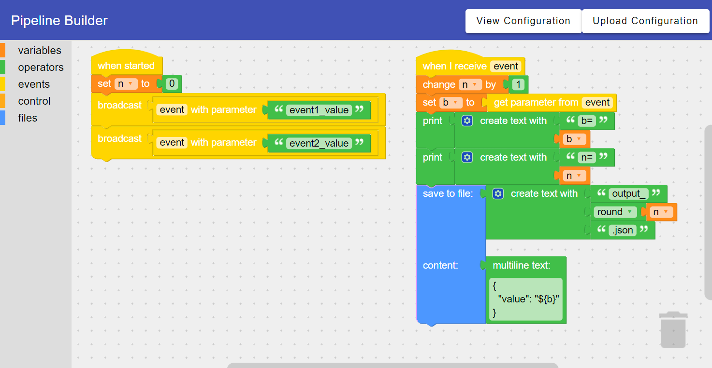

# blockly-java

[](https://github.com/less-xx/blockly-java/actions/workflows/maven.yml)

## Overview

## pipeline-build-web
This module is a web application that provides a web-based interface for creating the pipeline.




## pipeline-executor-docker
This module will build a docker image that contains the pipeline execution environment.
```
docker run -ti --rm pipeline-executor

usage: run-workspace
 -d,--dir <arg>           Working directory
 -f,--file <arg>          Workspace configuration file
 -h,--help                Print command usage
 -i,--instance-id <arg>   instance ID. Default is 1
    --timeout <arg>       execution timeout in seconds.
    --user-id <arg>       User ID who run this workspace
    --user-name <arg>     User name who run this workspace
 -w,--workspaceId <arg>   workspace ID. Default is random value
```